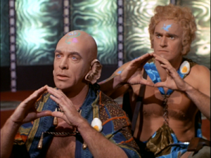
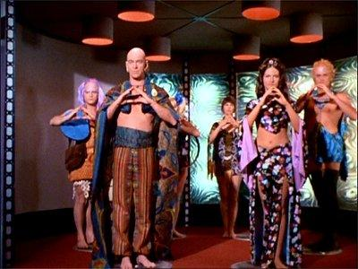

> We turn our backs on confusion and seek the beginning. 
> -- *Sevrin* 
	
Note: Clojure 1.9 will introduce a new core library, known as [**clojure.spec**][spec], which makes
*Herbert* obsolete.

[spec]: http://blog.cognitect.com/blog/2016/5/23/introducing-clojurespec

# Herbert

A schema language for **edn** (Clojure data).

[](#star-trek-reference)

The _extensible data notation_ **(edn)** defines a useful subset of Clojure data types.  As
described on [edn-format.org](http://edn-format.org):

> **edn** is a system for the conveyance of values.
> It is not a type system, and has no schemas.

The explicit lack of schemas in **edn** stands in marked contrast to many serialization libraries
which use an interface definition language.  The **edn** values essentially speak for themselves,
without the need for a separate description or layer of interpretation.  That is not to say that
schemas aren't potentially useful, they're just not part of the definition of the **edn** format.

The goal of the *Herbert* project is to provide a convenient schema language for defining **edn**
data structures that can be used for documentation and validation.  The schema patterns are
represented as **edn** values.

## Leiningen

*Herbert* is available from Clojars.  Add the following dependency to your *project.clj*:

[![Herbert on clojars.org][latest]][clojar]

[latest]: https://clojars.org/com.velisco/herbert/latest-version.svg "Herbert on clojars.org"
[clojar]: https://clojars.org/com.velisco/herbert

## Usage

The main namespace is `miner.herbert`.  The `conforms?` predicate takes a schema pattern and
a value to test.  It returns `true` if the value conforms to the schema pattern, `false`
otherwise.

The `conform` function is used to build a test function.  Given a *schema*, it returns a function of
one argument that will execute a match against the schema pattern and return a map of bindings if
successful or nil for a failed match.  If you need to know how the schema bindings matched a value
or you want to test against a schema multiple times, you should use `conform` to define a test
function.

Quick example:

```clojure
(require '[miner.herbert :as h])
(h/conforms? '{:a int :b [sym+] :c str} '{:a 42 :b [foo bar baz] :c "foo"})
;=> true

;; For better performance, create a test function with `h/conform`.
(def my-test (h/conform '{:a (:= A int) :b [sym+] :c str}))
(my-test '{:a 42 :b [foo bar baz] :c "foo"})
;=> {A 42}

```

## Test.Check integration

The `property` function takes a predicate and a schema as arguments and returns a
[test.check][sc] property suitable for generative testing.  (*test.check* also has a `defspec`
macro for use with *clojure.test*.)  If you just want the generator for a schema, call
`generator`.  The `sample` function is similar to test.check version but takes a schema.

[sc]: https://github.com/clojure/test.check "test.check"

```clojure
(require '[miner.herbert.generators :as hg])
(require '[clojure.test.check :as tc])

;; trivial example
(tc/quick-check 100 (hg/property integer? 'int))

;; confirm the types of the values
(tc/quick-check 100 (hg/property (fn [m] (and (integer? (:int m)) (string? (:str m)))) 
	                             '{:int int :str str :kw kw}))

;; only care about the 42 in the right place
(tc/quick-check 100 (hg/property (fn [m] (== (get-in m [:v 2 :int]) 42))
                                '{:v (vec kw kw {:int 42} kw) :str str}))

;; samples from a schema generator
(clojure.test.check.generators/sample (hg/generator '[int*]))
;=> (() (9223372036854775807) [9223372036854775807] () [] (1 1) () [-7] (4) [-5])

;; generate samples directly from a schema (notice the "hg" namespace)
(hg/sample '[int*])
;=> (() [-1 0] () (9223372036854775807) [9223372036854775807] [] () () [0 -5] [9223372036854775807] (7 9223372036854775807) [] (12 -11) (-9223372036854775808) [-12 9223372036854775807] [-10 9223372036854775807] (-11) [2] (-11) [-7])

```

## Notation for Schema Patterns

* Literal constants match themselves: <BR>
**nil**, **true**, **false**, *numbers*, *"strings"*, *:keywords*

* Empty literal collections match themselves: <BR>
**[]**, **()**, **{}**

* A simple schema pattern is named by a symbol: <BR>
  - **int** - integer
  - **float** - floating-point
  - **str** - string
  - **kw** - keyword
  - **sym** - symbol
  - **vec** - vector
  - **list** - list or cons (actually anything that satisfies `clojure.core/seq?`)
  - **seq** - any sequential (including vectors)
  - **map** - map
  - **char** - character
  - **bool** - boolean
  - **any** - anything

* A few additional schema patterns for numeric sub-types:
  - **num** - any number
  - **pos** - positive number
  - **neg** - negative number
  - **zero** - zero number
  - **even** - even integer
  - **odd** - odd integer

* A quantified schema pattern: adding a __*__, __+__ or __?__ at the end of a symbol for
  zero-or-more, one-or-more, or zero-or-one (optional): <BR>
__int*__, __str\+__, __sym?__

* A quoted expression matches itself without any other interpretation: <BR>
**'foo?** matches the symbol _foo?_ literally.<BR>

* A compound schema pattern: using **and**, **or** and **not** <BR>
`(or sym+ nil)`  -- one or more symbols or nil <BR>
`(or (vec int*) (list kw+))`  -- either a vector of ints or a list of one or more keywords

* A quantified schema pattern: a list beginning with __*__, __+__ or __?__ as the first element. <BR>
`(* kw sym)`  -- zero or more cycles of keywords and symbols

* A named schema expression is written as a list with the first element being the `:=` operator,
  followed by a (non-reserved) symbol as the binding name, and the rest of the list being a schema
  pattern.  The names of predicates and special operators (like **and**, **or**, etc.) are not
  allowed as binding names.  The name may be used as a parameter to other schema patterns.
  Also, the name may be used in the pattern expression to create a recursive pattern.<BR>
`(:= N int 1 10)` -- matches 1 to 10 (inclusive)<BR>
`(:= A (or :a [:b A]))` -- matches [:b [:b [:b :a]]]

* A bound symbol matches an element equal to the value that the name was bound to
  previously. <BR>
`[(:= N int) N N]` -- matches [3 3 3]
	
* A literal vector [in square brackets] matches any sequential (not just a vector) with the
  contained pattern. <BR>
`[(* kw sym)]`  -- matches (:a foo :b bar :c baz) and [:a foo]

* A literal map in {curly braces} matches any map with the given literal keys and values
  matching the corresponding schemas.  Optional keywords are written with a _?_ suffix such as
  **:kw?**.  (Use a quote mark to match a literal keyword ending with _?_.  **':k?** matches _:k?_
  literally without any special interpretation of the _?_ suffix.) For convenience, an optional
  keyword schema implicitly allows **nil** for the corresponding value. An empty literal map
  _{}_ matches exactly the empty map.  Use `map` to match any map. <BR>
`{:a int :b sym :c? [int*]}`  -- matches {:a 10 :b foo :c [1 2 3]} and {:a 1 :b bar} <BR>
`{:x? sym ':k? int}`  -- matches {:k? 10} but not {:k 10} because the keyword was quoted.

* The literal map in {curly braces} may also contains a single pair of patterns with a
  non-literal key pattern.  All keys and and values are required to match in the map value.
  This kind of pattern is useful for matching "functional" maps. <BR> 
`{kw int}` -- matches {:a 10 :b 20}, but not {:a 1 :b "bar"}

* A literal #{set} with multiple schema patterns denotes the required elements, but does
  not exclude others.  A single element might match multiple patterns.  A set with a quantified
  schema pattern defines the requirement on all elements. <BR>
`#{int :a :b}` -- matches #{:a :b :c 10}, but not #{:a 10} <BR>
`#{int+}` -- matches #{1 3 5}, but not #{1 :a 3}

* Numeric schema patterns, such as __int__, __even__, __odd__, __float__, or __num__, may take
  optional parameters in a list following the pattern name.  Numerics take a _low_ and a _high_ parameter.
  The value must be between to the _low_ and _high_ (inclusive) for it to match.  If only one
  parameter is given, it defines the _high_, and the _low_ defaults to 0 in that case.  If neither
  is given, there is no restriction on the high or low values.  Quantified numeric patterns apply the
  _high_ and _low_ to all the matched elements. <BR>
`(int 1 10)`  -- matches 4, but not 12

* String, symbol and keyword schema patterns (such as __str__, __sym__ and __kw__) may take an
  optional regex argument, specified as a string (for **edn** compatibility) or a Clojure regular
  expression (like `#"[Rr]ege?x"`).  In that case, the `pr-str` of the element must match the
  regex. <BR>
`(kw ":user/.*")` -- matches :user/foo

* An inlined schema pattern:  a list starting with `&` as the first element refers to multiple
  elements in order (as opposed to being within a collection).  It can be useful for adding `when`
  tests where an extra element would not normally be allowed.<BR>
`{:a (:= N int) :b (& (:= F float) (> N F))}` -- matches {:a 4 :b 3.14}

* The `map` schema predicate matches a map.  It takes the same arguments as the {curly brace}
  literal map schema.  With no arguments, `(map)` matches any map, same as `map`.  Use `{}` to
  match the empty map. <BR>
`(map :a int :b sym :c? [int*])`  -- matches {:a 10 :b foo :c [1 2 3]} and {:a 1 :b bar}

* The `list` schema predicate matches a list or cons.  It can take multiple optional arguments to
  specify the schemas for the ordered elements of the list. <BR> 
`(list sym (* kw int))` -- matches (foo :a 42 :b 52 :c 22)

* The `vec` schema predicate matches a vector.  It can take multiple optional arguments to
  specify the schemas for the ordered elements of the vector. <BR> 
`(vec int (* sym int))` -- matches [4 foo 42 bar 52]

* The `seq` schema predicate matches any sequential (vector or list).  It's basically the same as
  using the [square bracket] notation. <BR>
`(seq kw int sym)` -- matches (:a 10 foo) and [:b 11 bar]

* The `set` schema predicate matches a set.  It's basically the same as the #{set} literal
  notation. <BR>
`(set :a :b)` -- matches #{:a :b :c 10}, but not #{:a 10} <BR>
`(set int+)` -- matches #{1 3 5}, but not #{1 :a 3}

* A list starting with `class` followed by a dotted symbol matches an instance of that Java class.
  In general, you should avoid bringing classes directly into your schema pattern.  It's more
  flexible and extensible to use `tag`. <BR>
`(class java.util.Date)` -- matches a java.util.Date, but not a java.util.Calendar

* The `tag` list pattern takes a symbol as its first argument.  The pattern matches against
  the `edn-tag` of the item.  The first argument may also be a string which is interpreted
  as a regex matching the `pr-str` of the `edn-tag`.  The optional second argument may be a
  literal (such as a "string") in which case the value is whatever constant
  `edn/read-string` would construct by reading a string with that tag and literal.  On the
  other hand, if the option second argument is a non-literal schema pattern that pattern
  will be matched against the `edn-value` of the item.  For example, the Herbert `map`
  notation would be appropriate for matching a record value.  The `edn-tag` and `edn-value`
  are defined in the [tagged][] project.  See the `miner.tagged.EdnTag` protocol for more
  information.  Basically, the `edn-tag` is the symbol that normally would be used to print
  as a _tagged record_ (record class `my.ns.Rec` would use tag `my.ns/Rec`).  Several Java
  classes corresponding to built-in tagged literals (see
  `clojure.core/default-data-readers`) have predefined tags as well.  The `edn-value` is
  typically a map for a record or the item itself for most other classes.  Custom records
  and Java classes can extend the `miner.tagged.EdnTag` protocol to participate in `tag`
  pattern matching. <BR> 
`(tag my.ns/Rec {:a int})` -- matches an instance of the record
  class `my.ns.Rec` with an integer value for the key `:a`. <BR> 
`(tag inst)` -- matches any
  instance of java.util.Date, java.util.Calendar or java.sql.Timestamp

[tagged]: https://github.com/miner/tagged "tagged"

* The `pred` list pattern takes as the first argument the name of a Clojure function that should be
  called to test the input.  The function name should be a fully qualified symbol naming the var
  holding the predicate function.  If the predicate is parameterized, the implementing function
  should take those parameters first.  In all cases, the last argument should be the item in
  question.  Note that the predicate should accept all values for consideration without throwing an
  exception.  For example, the `even` schema predicate is implemented with a test of
  `clojure.core/integer?` as well as `clojure.core/even?` because the latter will throw on
  non-integer values.  The default predicates are defined in the var
  `miner.herbert/default-predicates`. <BR>
`(pred clojure.string/blank?)` -- matches nil or "" or "  "  

* The `grammar` pattern defines a grammar for more complex schema patterns.  The first
  argument is the *start-pattern* which is the actual pattern to match.  It is followed by
  zero or more rules, declared as an inline pair of a symbol, the `term`, and its pattern
  definition.  A rule can refer to previously defined terms or use its own term symbol in a
  recursive pattern.  The *start-pattern* can refer to any of the terms in the `grammar`
  form.  If you want to go crazy, you can nest another `grammar` pattern as the definition
  of a term, but the nested `grammar` expression is in an isolated scope so its rules are
  not available to the outer scope. <BR>
`(grammar [person+] phone (str "\\d{3}+-\\d{3}+-\\d{4}+") person {:name str :phone phone})` --
  matches [{:name "Herbert" :phone "408-555-1212"} {:name "Jenny" :phone "415-867-5309"}]
  

## Regular Expression Support

For conformance testing (as with `conforms?`), *Herbert* allows several terms to be
parameterized by regular expression (see `str`, `sym`, etc).  Both the Clojure syntax
for regular expressions and the Java String format are allowed (see
*clojure.core/re-pattern* and *java.util.regex.Pattern*.)  Note that Clojure regular
expressions (like `#"foo+bar*"`) are not **edn** types, so you should use Strings if you want your
*Herbert* schemas to be completely **edn**-compatible.  The main difference is that Java String
notation requires you to use double backslashes to get the effect of a single backslash in
your regex.  For example, Clojure `#"foo\d"` would be written as the String `"foo\\d"`.

Although the full Java regular expression syntax is supported for conformance testing, the
*Herbert* generator implementation supports only a limited form of regular expressions.
(Someday, *test.check* may support a regex generator, but for now, *Herbert* has to implement
string generation as best it can.)  The built-in string generator supports basic regular
expressions with ASCII characters, such as `"[a-z] [^abc] a.b* c+d(ef|gh)? \d\D\w\W\s\S"`.  It
does not support advanced regex features such as unicode notation, minimum and maximum match
counts, intersection character classes, POSIX character classes, case-insensitity flags,
look-ahead, look-back, back-references, greedy, reluctant or possessive quantification, etc.

The dynamic Var `*string-from-regex-generator*` allows the user to customize the
*test.check* string generator used internally by *Herbert*.  When
`*string-from-regex-generator*` is bound to a *test.check* generator, *Herbert* will use
this generator for any term that is parameterized by a regular expression.  The generator
should take one argument, which can be either a **java.util.regex.Pattern** or a **String**,
as the regex.  It should generate strings that match the given regex.  When it's bound to nil
(the default), *Herbert* will use its internal string generator as described above.

If you need better support for Java regular expressions when generating Strings, you should
consider using the [test.chuck][chuck] library which provides the `string-from-regex`
generator.  You can use it with *Herbert* like this:

[chuck]: https://github.com/gfredericks/test.chuck "test.chuck"


```clojure
(require '[com.gfredericks.test.chuck.generators :as chuck])
(require '[miner.herbert :as h])
(require '[miner.herbert.generators :as hg])

(binding [h/*string-from-regex-generator* chuck/string-from-regex]
	(hg/sample '(str #"\x66oo\dbar{1,3}") 5))

;=> ("foo5bar" "foo2barr" "foo5barrr" "foo2barrr" "foo9bar")
```


## Experimental Features

These features are implemented as an experiment, but I'm not sure I'll keep them as they're a bit of
a hack:

* The `when` form does not consume any input.  The expression is evaluated within the enviroment
  of the previous bindings -- if it returns a logical true, the match continues.  On a logical
  false, the whole match fails. <BR>
`[(:= N int) (:= M int) (when (== (* 3 N) M))]` -- matches [2 6]

* A list starting with `=`, `==`, `not=`, `<`, `>`, `<=` or `>=` is an *implied when* and treated
  as if the form was within an `when` test. <BR>
`[(:= N int) (:= M int) (== (* 3 N) M)]` -- matches [2 6]

## Examples

```clojure
(require '[miner.herbert :as h])

(h/conforms? 'int 10)
;=> true

(h/conforms? '(grammar int) 10)
; a very simple "grammar" with no rules, equivalent to the start pattern
;=> true

(h/conforms? '(grammar {show numbers}, show str, numbers [int+]) '{"Lost" [4 8 15 16 23 42]})
; target pattern can use named subpatterns defined by tail of name/pattern pairs
;=> true

(h/conforms? '(:= A (or :a [:b A])) [:b [:b [:b :a]]])
; matches a recursive binding of `A`
;=> true

(h/conforms? '{:a int :b sym :c? [str*]} '{:a 1 :b foo :c ["foo" "bar" "baz"]})
;=> true

(h/conforms? '{:a int :b sym :c? [str*]} '{:a 1 :b foo})
; :c is optional so it's OK if it's not there at all.
;=> true

(h/conforms? '{:a int :b sym :c? [str*]} '{:a foo :b bar})
;=> false

(h/conforms? '{:a (:= A int) :b sym :c? [A+]} '{:a 1 :b foo :c [1 1 1]})
; `A` is bound to the int associated with :a, and then used again to define the values
; in the seq associated with :c.  
;=> true

(h/conforms? '(& {:a (:= A int) :b (:= B sym) :c (:= C [B+])} (when (= (count C) A))) 
           '{:a 2 :b foo :c [foo foo]})

; The & operator just means the following elements are found inline,
; not in a collection.  In this case, we use it to associate the
; when-test with the single map constraint.  The assertion says that
; number of elements in the :c value must be equal to the value
; associated with :a.  Notice that all the elements in the :c seq
; must be equal to the symbol associated with :b.
=> true

((h/conform '[(:= A int) (:= B int) (:= C int+ A B)]) [3 7 4 5 6])
; Inside a seq, the first two ints establish the low and high range of the rest 
; of the int values.
;=> {C [4 5 6], B 7, A 3}

(def my-checker (h/conform '[(:= MAX int) (:= XS int+ MAX)]))
(my-checker [7 3 5 6 4])
;=> {XS [3 5 6 4], MAX 7}

(defn palindrome? [s]
	(and (string? s)
		(= s (clojure.string/reverse s))))
		
(h/conforms? '(grammar [pal+]
	              palindrome user/palindrome?
                  pal {:len (:= LEN int) :palindrome (and palindrome (cnt LEN))})
             [{:palindrome "civic" :len 5}
              {:palindrome "kayak" :len 5} 
              {:palindrome "level" :len 5}
              {:palindrome "ere" :len 3}
              {:palindrome "racecar" :len 7}])
;=> true
```

## Templates

If you want to mix external data into a Herbert pattern, I suggest that you use the
[backtick][bt] library's `template` function.

[bt]: https://github.com/brandonbloom/backtick "Backtick"


## References

* edn: http://edn-format.org
* Clojure: http://clojure.org
* Square Peg parser:  https://github.com/ericnormand/squarepeg
* tagged:  https://github.com/miner/tagged
* test.check: https://github.com/clojure/test.check
* "The Way to Eden" lightning talk at Clojure/Conj 2013 
    * slides:  https://github.com/miner/way-to-edn
    * video:  http://www.youtube.com/watch?v=bmHTFo2Rf2w&t=19m55s
* "Generating Generators" talk at Clojure/Conj 2014
    * slides: https://speakerdeck.com/miner/generating-generators
	* video: https://www.youtube.com/watch?v=4JGu33WF0Us

## Related Projects
If *Herbert* isn't exactly what you're looking for, here are some other projects that take
different approaches to similar problems:

* clj-schema:  https://github.com/runa-dev/clj-schema
* Prismatic Schema:  https://github.com/prismatic/schema
* Strucjure: https://github.com/jamii/strucjure
* Sequence Expressions (seqex): https://github.com/jclaggett/seqex
* Regexp for Sequences (seqexp): https://github.com/cgrand/seqexp
* Truss: https://github.com/ptaoussanis/truss
* Structural Typing: https://github.com/marick/structural-typing/
* Annotate: https://github.com/roomkey/annotate

## Herbert is obsolete as of Clojure 1.9
* clojure.spec: http://blog.cognitect.com/blog/2016/5/23/introducing-clojurespec


## Star Trek: _The Way to Eden_  

stardate 5832.3

**Space Hippies**: "Herbert, Herbert, Herbert ..."  
**Spock**: "Herbert was a minor official notorious for his rigid and limited patterns of thought."  
**Kirk**: "Well, I shall try to be less rigid in my thinking."  

video clip:  http://www.youtube.com/watch?v=PQONBf9xMss

[](http://www.youtube.com/watch?v=PQONBf9xMss)

## Copyright and License

Copyright (c) 2013 Stephen E. Miner.

Distributed under the Eclipse Public License, the same as Clojure.
